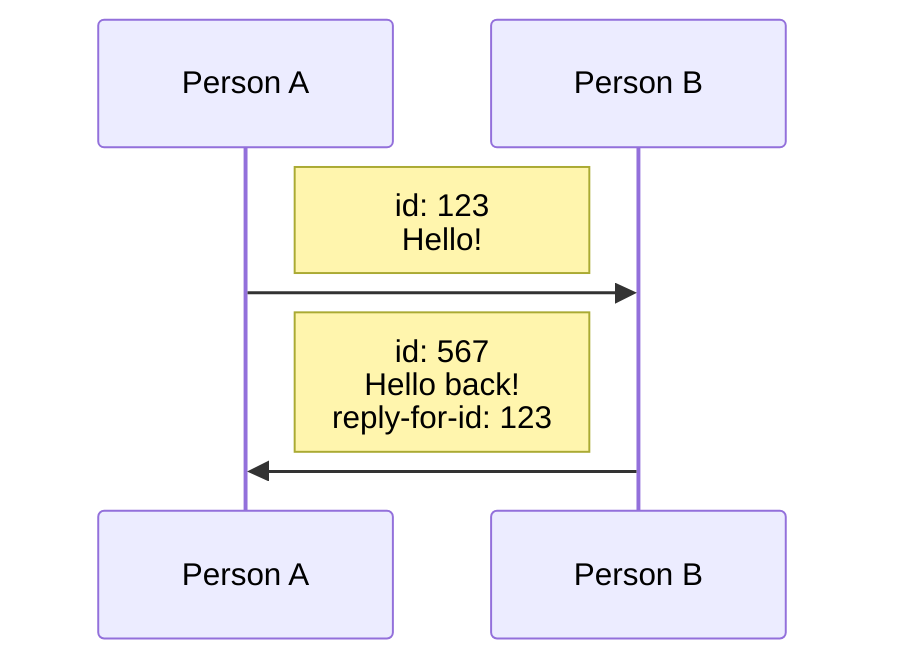

# Actor model

CosmWasm, at its core, is built around the actor model. This prevents some common pitfalls which,
for example, Ethereum smart contracts had to fix over the years. The issues mostly revolved around
[reentrancy issues] where we could, for example, call out to another contract before finishing the
current execution.

:::tip

If you are already familiar with the actor model through, for example, programming in languages
such as Erlang or Elixir, you can skip this page.

:::

While the term "actor model" sounds fancy, it is actually quite simple. Each contract is an "actor"
and _plays_ a role in the system (pun intended).

Each actor has its own state and can only be interacted with via messages. This means a contract can
only interact with the outside world via messages and only manipulate its own state.

Picture two people living in two houses, each house has a mailbox. If person A wants to talk to
person B, they write a letter, address it to person B, and send it off. The mailman (or in this
case, the chain) will put the letter in person B's mailbox.

Person B will then read the letter and can choose to write a response, address it to person A with a
note indicating that this is a reply, and send it off once again.

No direct interaction is happening here, nobody visits each other's house which would allow them to
rummage around in their belongings (state). They simply exchange messages and put everything the
other side needs to know into a message.

As you can see in the simple graphic above, they simply exchange messages addressed to each other,
and the messages reference previous messages if need be.

:::tip

In CosmWasm you can only pass a single message type to a contract endpoint. If you are wondering
how to handle multiple message types, check out the [enum dispatch](../conventions/enum-dispatch) page.

:::

But how does that fix reentrancy? In CosmWasm, you can only send out messages at the end of a
contract execution as part of the response. This ensures you have already written everything to the
state, meaning the state can't suddenly change mid-execution and make your contract exhibit buggy
behaviour.

CosmWasm effectively forces you to follow the [CEI pattern (Checks, Effects, Interactions)] while
other similar systems only have this as a "best practice".

[reentrancy issues]: https://ethereum.org/en/developers/docs/smart-contracts/security/#reentrancy
[CEI pattern (Checks, Effects, Interactions)]: https://fravoll.github.io/solidity-patterns/checks_effects_interactions.html
